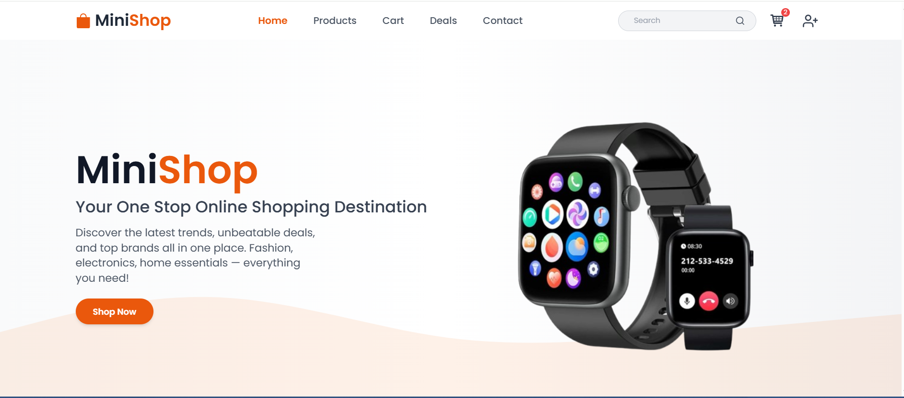

# 🛍️ Modern E-commerce App with Firebase Auth & Protected Routes (React)

A modern and responsive **E-commerce web app** built using **React.js**, featuring:
- Firebase Authentication (Login/Register)
- Protected Routes using React Router
- Product listing from an API and custom dummy products
- Context API for managing authentication state
- Responsive design using Tailwind CSS

---

## 🔥 Features

- ✅ Product display from [Fake Store API](https://fakestoreapi.com/)
- 🧪 Dummy products for variety
- 📂 Category-based filtering with buttons
- ⏳ Loading spinner for async data fetch
- 💬 Add to Cart button (alert-based for now)
- 🧭 Routing with React Router (v6+)
- 🔐 Protected Routes (only accessible after login)
- 🔥 Firebase Authentication (Sign In / Sign Up / Sign Out)
- 🧠 React Context for managing auth state
- 📱 Responsive design with Tailwind CSS

---

## ⚙️ Installation & Setup

### 1. Clone the repo
```bash
git clone https://github.com/your-username/ecommerce-auth-app.git
cd ecommerce-auth-app 
```


## 📸 Screenshot



📑 License
This project is open-source and available under the MIT License.

🤝 Contributing

Contributions, issues and feature requests are welcome!
Feel free to fork the repo and submit a pull request.

🙋‍♀️ Author

 Made by Faria Abid
 
 💬 Contact

If you have any questions or feedback, feel free to reach out to me:

Email: [fariaabid473@gmail.com]


